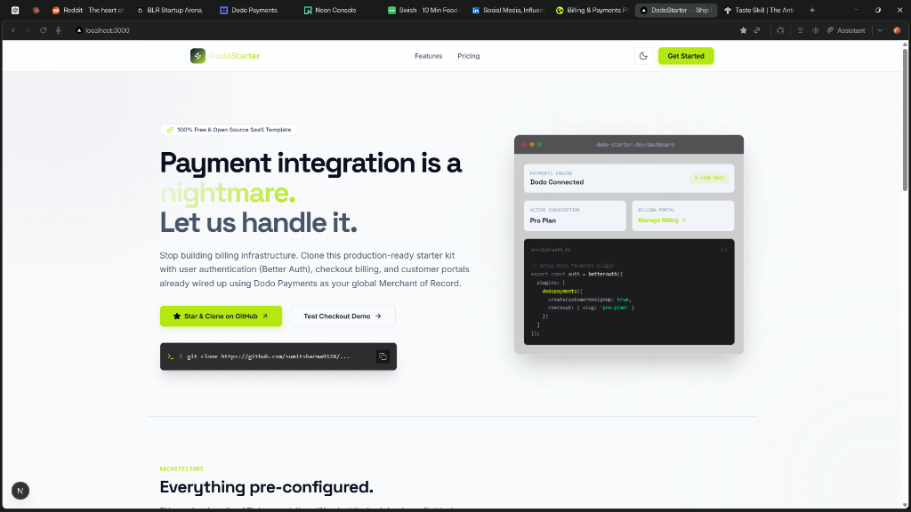

# DodoStarter

DodoStarter is a polished, developer-first Next.js SaaS starter kit pre-configured with Better Auth and Dodo Payments for subscription checkouts, self-service customer billing portals, and automated Postgres database sync via webhooks.



---

## Prerequisites

To start building, ensure you have:
- Node.js (v18+ recommended)
- A Dodo Payments Account (for sandbox/live API access)
- A Neon Postgres Database connection string (or any other Postgres instance)

---

## Step-by-Step Setup

### 1. Clone the Repository & Install Dependencies

```bash
git clone https://github.com/sumitttt4/Paymentintegration.git
cd Paymentintegration
npm install
```

### 2. Configure Environment Variables

Duplicate the example environment file:
```bash
cp .env.example .env
```

Open `.env` and configure every required parameter:

| Variable | Description |
|---|---|
| `DATABASE_URL` | Your Postgres connection string. Neon database is recommended. |
| `BETTER_AUTH_SECRET` | Secret key used to sign Auth tokens (run `openssl rand -hex 32` to generate one). |
| `BETTER_AUTH_URL` | The application base URL (e.g. `http://localhost:3000` locally). |
| `DODO_PAYMENTS_API_KEY` | Dodo developer secret key (Dashboard > Developer > API Keys). |
| `DODO_PAYMENTS_WEBHOOK_SECRET` | Secret key to verify incoming webhook payloads (Dashboard > Developer > Webhooks). |
| `DODO_PAYMENTS_ENVIRONMENT` | Set to `test_mode` for sandbox development, or `live_mode` for production. |
| `NEXT_PUBLIC_DODO_PRO_PRODUCT_ID` | The product ID for your Pro subscription (Dashboard > Products). |
| `NEXT_PUBLIC_DODO_ENTERPRISE_PRODUCT_ID` | The product ID for your Enterprise subscription (Dashboard > Products). |

---

### 3. Create Subscription Products in Dodo Payments

1. Sign in to your Dodo Payments Dashboard.
2. Go to **Products** and click **Add Product**.
3. Create a **Pro Plan** subscription (e.g. $29/mo) and an **Enterprise Plan** subscription (e.g. $99/mo).
4. Copy the generated product IDs (starting with `pdt_`) and paste them into your `.env` file under `NEXT_PUBLIC_DODO_PRO_PRODUCT_ID` and `NEXT_PUBLIC_DODO_ENTERPRISE_PRODUCT_ID`.

> [!WARNING]
> Ensure that the text pricing values and periods displayed in the landing page UI (`src/app/page.tsx` line 27-74) match the pricing and currencies structured inside your Dodo product dashboard.

---

### 4. Configure Webhooks & Local Port Forwarding (ngrok)

Dodo Payments must reach your local server to notify your application of subscription active, cancel, renewal, and hold states in real time.

1. **Install ngrok** (if you haven't):
   ```bash
   npm install -g ngrok
   ```
2. **Tunnel Port 3000**:
   ```bash
   ngrok http 3000
   ```
3. Copy the secure forwarding URL generated by ngrok (e.g. `https://[subdomain].ngrok-free.app`).
4. **Register Webhook**:
   - Go to your Dodo Payments Dashboard > Developer > Webhooks.
   - Click **Add Webhook**.
   - Input the payload URL: `https://[subdomain].ngrok-free.app/api/auth/dodopayments/webhooks`.
   - Select the events you want to listen to (we recommend checking all subscription events).
   - Copy the webhook secret generated by Dodo and paste it into your `.env` as `DODO_PAYMENTS_WEBHOOK_SECRET`.
5. Update `BETTER_AUTH_URL` in `.env` to point to the ngrok domain to ensure redirects route back to your local development session.

---

### 5. Run Database Migrations & Start Server

Generate the auth and subscription tables in your Postgres database and spin up the development server:

```bash
# Push schema changes to your database
npm run db:push

# Spin up Next.js dev server
npm run dev
```

Visit `http://localhost:3000` locally.

---

## Testing Checkouts

To verify the checkout flow locally:
1. Navigate to the login page and sign up a new account. A Dodo Payments customer profile is automatically provisioned and synced to the database.
2. Navigate to the pricing section and click **Redirect to checkout** on a plan.
3. You will be redirected to the secure Dodo hosted checkout page.
4. Use Dodo's test cards to trigger successful sandbox checkouts. You can insert any valid test credit card format (e.g. `4242 4242 4242 4242`, future expiration date like `12/32`, and any CVV code).
5. Once payment completes, you will be redirected back to `/dashboard?checkout=success`.
6. Verify that ngrok log displays a POST request to `/api/auth/dodopayments/webhooks` and that your user dashboard displays the updated active subscription.

---

## Deploy to Vercel

1. Commit your codebase and push to a private/public GitHub repository.
2. Import the project in Vercel.
3. Configure the environment variables matching your production credentials. Set `DODO_PAYMENTS_ENVIRONMENT` to `live_mode` for live keys.
4. Update the webhook endpoint URL in your Dodo Payments live dashboard:
   `https://[your-production-domain].com/api/auth/dodopayments/webhooks`

---

## License

This project is open-source and licensed under the [MIT License](LICENSE).
